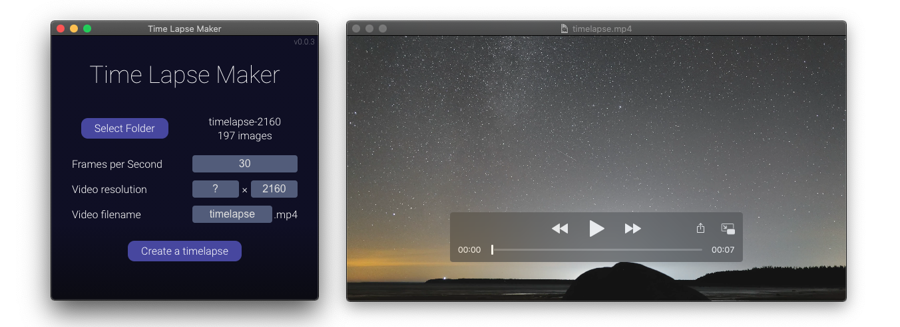

[mac]: https://github.com/Aurora-Hunters/timelapse-maker/releases/latest/download/Time-Lapse-Maker.dmg
[win]: https://github.com/Aurora-Hunters/timelapse-maker/releases/latest/download/Time-Lapse-Maker.exe
[linux]: https://github.com/Aurora-Hunters/timelapse-maker/releases/latest/download/Time-Lapse-Maker.AppImage

# Time Lapse Maker

Simple application for assembling time lapses.

Choose a directory with photos, set FPS and resolution and get a video.

[][mac]  [][win]  [][linux]

Releases and changes [page](https://github.com/Aurora-Hunters/timelapse-maker/releases/latest).

## Demo

## Issues and improvements

Feel free to report bugs with reproduction steps or requests any features on the [issues](https://github.com/Aurora-Hunters/timelapse-maker/issues) page.

## Development

[development.md](./docs/development.md) — how to run local version and publish a new release.
